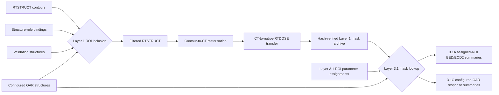

# Eclipse DICOM-RT to Layer 3.1 workflow audit

**Audit date:** 2026-09-08  
**Repository state:** `9c579dc84bb75d873124711f06a9336fa1910364` (`9c579dc-dirty`)  
**Current software version:** 1.6.1  
**Audited case:** repository case alias `PHPROLRT01`, imported from a real Eclipse DICOM-RT export  
**Scope:** DICOM discovery and chain selection, Layer 1 rasterisation, validated handoff, fraction-history reconstruction, Layer 3.1 orchestration, persistence, presentation, export, and operational performance  
**Clinical-validation scope:** This is a software workflow and evidence audit. It is not independent clinical validation of the radiobiological models or the treatment plan.

## Audit decision

**Overall result: CONDITIONAL FAIL for a complete, reliably gated DICOM-RT-to-Layer-3.1 workflow.**

The real Eclipse export passes the DICOM relationship chain, source-integrity checks, Layer 1 dose/mask handoff, and Layer 3 fraction-history/basis gates. The present failure is downstream of rasterisation: the active case has no Layer 3.1 ROI assignments or biological parameter sets, and several orchestration defects can report or export an incomplete Layer 3.1 result as successful.

| Boundary | Decision | Evidence |
|---|---|---|
| Eclipse export discovery | PASS | 167 DICOM objects: 164 CT, one RTPLAN, one RTSTRUCT, one RTDOSE |
| RTDOSE -> RTPLAN -> RTSTRUCT -> CT chain | PASS | One unique complete UID-linked chain; no override used |
| Referenced CT instance coverage | PASS | All 164 contour-referenced CT SOP instances are present; no selected CT instance is unreferenced |
| Source immutability | PASS | Current RTPLAN, RTSTRUCT, RTDOSE, and all 164 CT hashes match the stored Layer 1 evidence |
| Layer 1 rasterisation | PASS WITH WARNINGS | Completed, native dose/mask gate PASS, Layer 3.1 eligible; plan approval and two volume comparisons remain warnings |
| Layer 1 -> Layer 3 handoff | PASS | Result, NPZ, dose, and nine mask hashes/shapes verified |
| Fraction-history reconstruction | PASS | One reconstructed biological event on an exact, identity-registered geometry |
| Layer 3 P/Q basis | PASS WITH WARNING | Deterministic basis built for the real 35,408,625-voxel grid; high-dose LQ caution recorded |
| Current complete Layer 3.1 run | NOT READY | No ROI assignments, tumour/normal MLQ sets, or TCP set; delivery mode is `unknown` |
| Aggregate status and export gates | FAIL | Branch-level BLOCKED results can produce a top-level success and exit code zero; stale or blocked stored results can be exported |
| Real multi-fraction scalability | FAIL | Fraction reconstruction materialises a full float64 dose array for every repeated fraction; the benchmark does not cover real-grid multi-fraction memory |

The DICOM-to-raster segment is operational on this case. The Layer 3.1 control plane is not yet safe to treat as a strict end-to-end completion gate.

## Actual end-to-end workflow

```mermaid
flowchart LR
    A[Eclipse export directory] --> B[Header-only DICOM inventory]
    B --> C[UID chain resolution]
    C --> D{Chain selected and valid}
    D --> E[Layer 1 preparation]
    E --> F[Selective RTSTRUCT rasterisation on CT]
    F --> G[Nearest-neighbour transfer to native RTDOSE]
    G --> H{Layer 1 eligibility and artifact hashes}
    H --> I[Layer 1 handoff loader]
    I --> J[Component and fraction-history reconstruction]
    J --> K{Exact geometry and history gates}
    K --> L[P=sum dose; Q=sum dose squared]
    L --> M[3.1A LQ]
    L --> N[3.1B MLQ tumour response]
    N --> O[3.1C therapeutic ratio]
    N --> P[3.1D TCP]
    M --> Q[Aggregate status]
    N --> Q
    O --> Q
    P --> Q
    Q --> R[Persist, present, export]
```



### Rasterisation boundary between Layer 1 and Layer 3.1

**Layer 1 is the only layer in this chain that rasterises DICOM contours. Layer 3.1 never rasterises an OAR.**

The apparent duplication comes from `oar_structures` being a shared cross-layer configuration:

1. Before Layer 1, it is an instruction to include the named RTSTRUCT ROI in the rasterisation set.
2. During Layer 3.1C, it is an instruction to select the already-rasterised Layer 1 mask for OAR biological summaries.



| Concern | Layer 1 rasterisation | Layer 3.1 ROI/OAR selection |
|---|---|---|
| Purpose | Convert RTSTRUCT polygon contours into voxel masks | Choose which existing masks participate in a biological calculation |
| Input representation | DICOM contour points and CT/RTDOSE geometry | Layer 1 ROI inventory plus hash-verified Boolean masks |
| Selection source | Union of `structure_bindings`, `validation_structures`, and identity-bound `oar_structures` | `layer31_roi_parameters` for 3.1A; `oar_structures` for 3.1C; effective GTV role for 3.1B/3.1D |
| Spatial operation | Polygon fill on CT followed by nearest-neighbour transfer to RTDOSE | None; array lookup and Boolean masking only |
| Output | Dose-grid mask, mask hash, volumes, coverage, and rasterisation status | BED/EQD2, survival, EUD/TR/TCP summaries, depending on branch parameters |
| Failure if ROI is unavailable | Layer 1 blocks when a required selected ROI produces no usable mask | Layer 3 blocks or records the OAR unresolved; it does not return to DICOM contours |
| Required rerun after OAR change | Yes | Layer 3 must wait for the new current Layer 1 artifact |

#### Layer 1 geometric selection

`ascend/layer1/selection.py:14-35` constructs the rasterisation set. An ROI is included when it is used as:

- a canonical target/structure role;
- an explicit validation structure; or
- a configured OAR/internal-target geometry structure.

The RTSTRUCT is filtered to those ROI numbers (`selection.py:38-54`; `ascend/layer1/execution.py:65-74`). Each selected contour is rasterised on the CT voxel-centre grid and transferred to the native RTDOSE grid (`ascend/layer1/incremental_raster.py:85-152`). Layer 1 then publishes:

- the Boolean mask array;
- the RTSTRUCT SOP Instance UID and ROI number;
- the canonical mask key;
- the selection reason;
- `rasterised`, `not_rasterised`, or `rasterisation_failed` status;
- mask and archive hashes; and
- contour, CT-grid, and dose-sampled volumes.

This is a geometric data-production step. Adding or removing an OAR changes scientific inputs, so the controller invalidates Layer 1 and every dependent layer (`ascend/app/controller.py:214-218`).

#### Layer 3.1 analytical selection

Layer 3.1 first opens the stored Layer 1 archive through the validated handoff. The archive hash, dose validity, and recorded mask hashes are checked before use. No RTSTRUCT contour is read and no polygon is filled.

- 3.1A resolves each `layer31_roi_parameters` assignment by RTSTRUCT UID plus ROI number and returns the existing canonical mask (`ascend/layer3/lq/service.py:319-327`).
- 3.1B and 3.1D use the existing mask bound to the effective GTV role.
- 3.1C iterates configured `oar_structures`, excludes entries classified as `internal_target_structure`, and resolves existing Layer 1 masks (`ascend/layer3/response/course.py:113-173`).

If a user selects a new OAR after Layer 1, the correct flow is:

```text
Select identity-bound RTSTRUCT OAR
-> invalidate current Layer 1 and downstream results
-> rerun Layer 1 to rasterise and hash the OAR mask
-> pass the new Layer 1 artifact through handoff validation
-> run Layer 3.1 and select that existing mask for the requested model
```

Layer 3.1 must never silently rasterise the newly selected OAR itself. That would bypass Layer 1 geometry validation, volume evidence, cache identity, and mask hashing.

#### Boundary defects requiring correction

1. **Shared configuration obscures stage ownership.** `oar_structures` means both “rasterise this ROI in Layer 1” and “analyse this existing mask in Layer 3.1C.” The UI and manifest should expose separate states: `requested_for_layer1_rasterisation` and `available_for_layer31_analysis`.
2. **3.1A assignment can precede mask availability.** Changing `layer31_roi_parameters` invalidates Layer 3.1 but not Layer 1. An assignment to an ROI that was never included in the Layer 1 raster set therefore fails only during Layer 3.1 mask lookup. The configuration selector should be restricted to current Layer 1 inventory entries with `rasterisation_status=rasterised`, or atomically add the ROI to the Layer 1 request and invalidate Layer 1.
3. **3.1C contains a name fallback.** It first uses exact RTSTRUCT UID plus ROI number, then falls back to original/canonical name when identity lookup fails (`course.py:140-152`). Post-raster biological selection should require exact stored identity. A name match can bind the wrong ROI after a structure-set change.
4. **Availability needs an explicit gate.** Layer 3.1 preflight should list each requested ROI as `RASTERISED_CURRENT`, `NOT_RASTERISED`, `STALE`, `IDENTITY_MISMATCH`, or `MISSING`, before loading full dose arrays.

For the audited real case, the OARs and internal geometry structures were already rasterised by Layer 1. Layer 3.1 would consume their stored masks; it would not create them again.

### Module and dependency audit

| Stage | Authoritative module | Required input | Gate or invariant | Output | Audit result |
|---|---|---|---|---|---|
| Discovery | `ascend/dicom/discovery.py` | Export directory | Readable DICOM headers and supported modalities | Inventory records | Modular; PASS |
| Chain resolution | `ascend/dicom/relationships.py` | Inventory | RTDOSE plan reference, plan structure reference, structure image-series reference, patient/frame consistency | Candidate chains and selection evidence | Mostly modular; completeness gaps remain |
| Chain selection | `ascend/app/controller.py` | Candidate chain | Unique complete chain or explicit audited override | Selected object paths | State can later be desynchronised |
| Layer 1 preparation | `ascend/layer1/preparation.py` | Selected objects and ROI bindings | Required objects, identity bindings, RTDOSE geometry, image geometry, source hashes | Prepared immutable input set and cache key | PASS on real case |
| Raster execution | `ascend/layer1/execution.py` and `incremental_raster.py` | Prepared input | Selected RTSTRUCT ROIs; locked validator; non-empty required masks | Native dose and masks | PASS; adapter uses a process-global patch under a lock |
| Layer 1 publication | `ascend/layer1/service.py` | Validator result | Eligibility, deterministic NPZ, hashes, atomic cache/publication | Layer 1 result manifest and archive | PASS, with one version-label inconsistency |
| Handoff | `ascend/scientific/legacy/layer21_validated.py` | Layer 1 directory | Eligibility, archive hash, finite non-negative dose, mask hashes | Dose and masks | PASS |
| Fraction history | `ascend/layer3/history.py` | Component sources and treatment context | Source hashes/UIDs, fraction count, exact geometry identity, grouping semantics | Ordered biological events | Correct semantics; unacceptable repeated-fraction memory scaling |
| Basis | `ascend/layer3/lq/basis.py` | Fraction history | Deterministic cache key and hash | P/Q fields | PASS |
| Layer 3.1 branches | `ascend/layer3/lq/service.py`, `response/`, `tcp/` | Basis, masks, tissue and timing parameters | Branch-specific gates | 3.1A/B/C/D results | Gates exist but are not reduced into a strict workflow result |
| Persistence/export | Layer 3.1 service and `ascend/reporting/export.py` | Stored result | Presently only checks that a result object exists | JSON/CSV artifacts | FAIL: current/completed status is not required |

## Real Eclipse case evidence

### Input and relationship evidence

- The stored inventory and a fresh header-only discovery agree exactly: 164 CT images, one RTPLAN, one RTSTRUCT, and one RTDOSE.
- One complete chain is selected automatically and stored as `chain_417e8056c7947f2f1214`.
- The selected RTSTRUCT references the selected CT series. Its 164 referenced CT SOP instances are all present. The selected series contains no additional unreferenced instance.
- No incomplete-chain override is recorded.
- SHA-256 checks of the live source files match the Layer 1 manifest for RTPLAN, RTSTRUCT, RTDOSE, and 164/164 planning images.

### Layer 1 evidence

Stored run: `ASCEND_L1_20260901_111629_165465`.

| Property | Value |
|---|---|
| Calculation state | `completed_with_warnings` / `WARN` |
| Interpretation state | `provisional` |
| Layer 2 eligible | true |
| Layer 3.1 eligible | true |
| Native dose/mask gate | PASS |
| Dose-grid shape | 329 x 205 x 525 |
| Voxel count | 35,408,625 |
| Spacing | 1.0 x 1.0 x 1.0 mm |
| Dose range | 0 to 16.54657 Gy |
| Exported masks | 9; every mask shape matches the dose grid |
| RTPLAN approval | `UNAPPROVED` |

The plan approval state is warning-level rather than blocking under the current policy. The Lung_L and HighDensityCTV CT-volume versus dose-sampled-volume comparisons are warning-level discrepancies. Their native dose coverage gates pass. These warnings must remain visible and must not be described as clinical acceptance.

### Layer 3 upstream evidence

The empty `layer31_component_sources` list correctly falls back to the current Layer 1 result for a single-plan course. Direct construction produced:

- GATE_0_UPSTREAM_DATA: PASS.
- GATE_2_SPATIAL_REGISTRATION: PASS using exact geometry identity; no registration, resampling, or dose warping was inferred.
- GATE_1_FRACTION_HISTORY: PASS with one reconstructed biological event.
- Geometry hash: `6015f440a7ceca601d86683a42c19099e5447067901884e2af9b9d202e6e33a4`.
- Fraction-history hash: `ef02c92e145a5e43ae5a9bb29d5ce0a6914beb0a56f23acd56ca677fe5fe43be`.
- Basis hash: `d8739663e8495ae6e2ff5d33fa81a2cbd4a055a06c565c2ba47ab0f441bf5bb9`.
- Basis warning: `conventional_lq_high_dose_caution`.

The audit created the expected deterministic cache entry `runs/all/cache/layer3_1/bd71fabd0eff1a42706b9a89ea16634c700365254de5391fc8e9a97130201939`. It did not change the case record or clinical source data.

### Current Layer 3.1 readiness

The current case record is `not_run`, and its configuration is not sufficient for complete 3.1A/B/C/D execution:

| Dependency | Current state | Effect |
|---|---|---|
| Component dose source | Implicit current Layer 1 | Valid for this single-plan case |
| Fractionation | One fraction | Resolvable |
| Treatment approach | `UNKNOWN` | Tolerated for one component; unsafe for multi-component grouping |
| Delivery mode | `unknown` | Biological delivery intent is unresolved |
| ROI alpha/beta assignments | Empty | 3.1A spatial ROI reporting cannot complete |
| Tumour MLQ parameter set | Empty | 3.1B blocks |
| Normal MLQ parameter set | Empty | 3.1C blocks or becomes non-applicable downstream |
| TCP parameter set | Empty | 3.1D blocks |
| Scenario selections | Empty | No scenario-specific biological result |
| TR reference schedule | Empty | Only a matched schedule can be inferred when all prerequisites exist |

This is the immediate reason a complete Layer 3.1 workflow cannot be produced from the active case. It is not evidence of a failed Eclipse import or failed Layer 1 raster.

## Findings

### A-01 — P1: aggregate Layer 3.1 status can report success with blocked branches

**Evidence:** `ascend/layer3/lq/service.py:478-485` declares the top level `completed_with_warnings` when 3.1B is applicable, even when 3.1A, 3.1C, or 3.1D is blocked. The configured-assignment path at `service.py:582-610` derives the top-level state from warnings, not the branch gate states.

The 52 stored real-case Layer 3.1 artifacts prove the effect:

| Measure | Count |
|---|---:|
| Top-level `completed_with_warnings` | 44 |
| Top-level `not_run` | 8 |
| Top-level successes containing at least one blocked A/B/C/D branch | 36 |
| 3.1A blocked | 21 |
| 3.1B blocked | 14 |
| 3.1C blocked | 11 |
| 3.1D blocked | 42 |

`ascend/cli.py:115-130` also ignores the requested Layer 3.1 state when deciding the exit code for `run --with-layer31`. A blocked Layer 3.1 workflow can return zero. The standalone `layer31` command checks only the defective top-level state.

**Required correction:** Define requested branches explicitly and reduce their states by severity. Any requested BLOCKED branch must make the complete-workflow result BLOCKED. NOT_APPLICABLE is acceptable only when the branch is explicitly out of scope. CLI exit status and UI completion must use the same reducer.

### A-02 — P1: repeated-fraction history scales linearly in full-volume RAM

**Evidence:** `ascend/layer3/history.py:216-220` constructs one full `source_dose / fraction_count` float64 array per repeated fraction. Each event retains its full array at `history.py:299-330`.

For the audited 35,408,625-voxel grid, one float64 fraction field is approximately 270.15 MiB. The repeated-fraction list alone therefore requires at least:

| Fraction count | Fraction-array memory only |
|---:|---:|
| 1 | 270 MiB |
| 5 | 1.32 GiB |
| 10 | 2.64 GiB |
| 30 | 7.91 GiB |

This excludes the source dose, P/Q arrays, masks, effects, survival fields, TCP fields, ZIP staging, and transient NumPy allocations. The only Layer 3.1 benchmark uses a 21 x 21 x 21 synthetic grid and one fraction (`benchmarks/layer31_fraction_event_benchmark.py:21-55`), so it cannot detect this failure mode.

**Required correction:** Represent identical fractions as one dose-per-fraction field plus multiplicity. Stream accumulation of P, Q, MLQ effect, maximum fraction dose, and event summaries. Materialise per-event arrays only for genuinely distinct explicit fractions and only within a bounded working set.

### A-03 — P1: export is not gated on current, complete results

**Evidence:** `ascend/layer3/lq/service.py:800-806` requires only a stored result. `ascend/reporting/export.py:40-130` exports stored layer results without requiring current parentage, a non-stale calculation state, complete requested branches, or a final artifact-integrity recheck. Invalidation marks records stale but does not remove their result objects.

**Impact:** A stale, blocked, or partially complete Layer 3.1 artifact can be exported alongside a current configuration and presented as the case result.

**Required correction:** Gate formal export on current configuration dependency hashes, current Layer 1 parent run/hash, allowed top-level status, required branch completion, and artifact hashes. Permit a separate diagnostic export only if it is visibly named `INCOMPLETE` or `STALE` in filenames and metadata.

### A-04 — P1: selected-chain identity can be desynchronised

**Evidence:** Chain selection binds all four object classes in `ascend/app/controller.py:180-188`. The public `select_dicom_object` method at `controller.py:291-299` can later replace RTDOSE, RTPLAN, RTSTRUCT, or image-series paths independently while leaving `selected_chain_id` and `chain_selection` unchanged.

Layer 1 contains downstream relationship checks, so many invalid combinations will block. The case audit trail can still claim that one chain is selected while the object set no longer represents it.

**Required correction:** Make a selected chain the immutable source of its member paths. Any independent member change must clear chain selection and require re-resolution, or atomically create and validate a new chain-selection record.

### A-05 — P1: malformed component delivery units escape the gate model

**Evidence:** `CaseConfiguration.validate` does not validate the full `layer31_component_sources` structure. `ascend/layer3/history.py:310-320` accepts an arbitrary `delivery_time_unit`. `ascend/layer3/response/course.py:59-68` indexes a fixed unit dictionary directly. The tumour-response gate at `course.py:281-285` catches `ValueError`, not `KeyError`.

An audit reproduction using `delivery_time_unit="fortnight"` raised raw `KeyError: 'fortnight'` rather than returning GATE_4_DELIVERY_TIME BLOCKED.

**Required correction:** Validate component records at configuration ingress with a versioned schema. Restrict units to seconds, minutes, or hours; validate finite non-negative values; normalize units once; convert all execution exceptions at this boundary into a controlled gate result.

### A-06 — P2: Layer 1 records two rasterisation standard versions

**Evidence:** The real Layer 1 manifest records `BARAT-L1-RASTER-CTNN-GAPSAFE-v3` in `dose_grid.rasterisation_standard` and `BARAT-L1-RASTER-CTNN-GAPSAFE-v4` in `rasterisation.standard_id` and `versions.rasterisation_algorithm_version`. The incremental adapter initially inherits the locked legacy constant at `ascend/layer1/incremental_raster.py:161`; the service overwrites only the latter standard at `ascend/layer1/service.py:217`.

**Required correction:** Publish one authoritative rasterisation algorithm identity in all manifest locations. Add a schema invariant test that rejects conflicting version fields.

### A-07 — P2: DICOM chain completeness is narrower than raster completeness

**Evidence:** `ascend/dicom/relationships.py:20-29` rejects conflicting non-empty patient and frame identifiers but permits missing identity identifiers. Lines 47-52 require a referenced image series with at least one image, not the complete set of contour-referenced SOP instances. UID dictionaries at lines 100-107 do not explicitly reject duplicate SOP or series identities.

The audited Eclipse case passes a stronger 164/164 instance-level check. The generic workflow does not enforce that check before rasterisation.

**Required correction:** Add a pre-raster DICOM chain-integrity gate for required identifiers, duplicate SOP/series detection, single-series geometry consistency, and exact contour-referenced image-instance coverage. Any permitted omission requires a typed override reason and preserved evidence.

### A-08 — P2: no shared, lightweight Layer 3.1 preflight exists

The GUI permits incomplete biological configurations to be saved and discovers blockers during a full run. Historical artifacts show repeated runs that successively encounter missing delivery time, missing normal kinetics, or missing clonogen density. This is valid for exploratory editing but inefficient for real volumes.

**Required correction:** Add a pure preflight that reads manifests and configuration without decoding full dose arrays. It must return a branch readiness matrix, exact missing fields, inferred versus explicit dependencies, estimated memory, and a deterministic request hash. GUI, CLI, service, and export must consume the same result.

### A-09 — P2: software-version compatibility is not an explicit handoff gate

The current application is 1.6.1 while the current Layer 1 evidence was produced by 1.5.0. Hash and schema checks pass, but no explicit compatibility policy records whether this Layer 1 algorithm/result schema is approved for consumption by the current Layer 3.1 implementation.

**Required correction:** Define a compatibility matrix keyed by Layer 1 result schema, raster algorithm, geometry algorithm, and Layer 3 basis algorithm. Record PASS, MIGRATION_REQUIRED, or RERUN_REQUIRED in preflight and provenance.

### A-10 — P3: remaining modularity and persistence debt

- `incremental_rasterisation` temporarily monkey-patches locked legacy functions. A process lock serialises and restores the patch, limiting concurrency damage, but this is an adapter rather than a clean dependency-injection boundary.
- `ASCENDCase.save` writes `ascend_case.json` directly (`ascend/models/case.py:87-92`), whereas major caches use temporary paths and atomic rename. A process interruption can damage the central audit record.
- A blocked 3.1A spatial result stores `blocking_reasons` but no `reason` (`ascend/layer3/lq/spatial.py:192-201`). The presenter reads `reason` and warnings, not `blocking_reasons` (`ascend/gui/layer3_presenters.py:40-48`), and can display “No blocking reason recorded” despite a recorded reason.

## Target dependency and gate flow

The optimal workflow is a staged state machine. Each stage consumes immutable evidence from the preceding stage and publishes one versioned decision record.

| Order | Stage | Required dependencies | Gate output | Heavy arrays allowed |
|---:|---|---|---|---|
| 0 | Immutable import inventory | Source paths, sizes, hashes, DICOM headers | `IMPORT_INVENTORY_PASS/BLOCKED` | No |
| 1 | Chain integrity and selection | Inventory and all referenced UIDs | One selected chain, exact member set, override evidence | No |
| 2 | Treatment and ROI configuration | Selected RTPLAN/RTSTRUCT identities | Versioned configuration with explicit treatment intent and ROI identities | No |
| 3 | Layer 1 preflight | Chain, geometry headers, configuration subset | Stable Layer 1 cache/request hash | No |
| 4 | Layer 1 raster | Preflight PASS | Immutable dose/mask archive, hashes, coverage and warning record | Yes; one ROI working set |
| 5 | Layer 3.1 preflight | Layer 1 manifests, requested branches, component schedules, parameter-set identities | Branch readiness matrix, compatibility result, memory estimate, request hash | No |
| 6 | Compact history plan | Preflight PASS | Distinct dose fields plus multiplicity and temporal metadata | Bounded |
| 7 | Streaming biological basis | Compact history | P/Q and required effect accumulators with hashes | Bounded |
| 8 | Requested 3.1 branches | Basis, masks, complete branch parameters | A/B/C/D branch gate records | Only requested fields |
| 9 | Strict aggregate reducer | Requested branch states | One top-level PASS/WARN/BLOCKED state | No |
| 10 | Current-only publication | Aggregate state, current dependency hashes, artifact hashes | Formal export manifest and files | As required |

### Required aggregate semantics

1. The run request declares which of 3.1A, 3.1B, 3.1C, and 3.1D are required.
2. BLOCKED in any required branch makes the aggregate BLOCKED.
3. FAILED in any required branch makes the aggregate FAILED.
4. NOT_APPLICABLE is accepted only for a branch declared optional or outside scope before execution.
5. WARN propagates to the aggregate when every required branch otherwise completes.
6. Export, UI state, automation, and CLI exit code use this single aggregate record.
7. Every branch exposes `reason`, `blocking_reasons`, `gate_results`, parameter hashes, source hashes, and parent run identifiers under one schema.

## Remediation order and acceptance criteria

### Release gate 1 — prevent false success and unsafe export

- Implement the strict aggregate reducer and requested-branch declaration.
- Return non-zero from every CLI path when a requested Layer 3.1 workflow is blocked or failed.
- Refuse formal export of stale, blocked, mismatched-parent, or hash-invalid results.
- Make presenters render `blocking_reasons` consistently.
- Acceptance test: exhaustive status-matrix tests across A/B/C/D; no combination containing a required blocked branch may produce success or formal export.

### Release gate 2 — fail before array loading

- Implement the shared manifest/configuration preflight.
- Validate component-source schemas, fraction counts, treatment grouping, units, parameter sets, ROI identities, and version compatibility.
- Bind selected object membership atomically to the selected chain.
- Acceptance test: malformed unit, missing identity, partial CT series, duplicate UID, stale parent, and incomplete parameter fixtures all produce deterministic BLOCKED records without loading dose arrays.

### Release gate 3 — make real multi-fraction operation bounded

- Replace repeated event arrays with field-plus-multiplicity representation.
- Stream P/Q and response accumulation.
- Add a benchmark using the real grid dimensions or an equivalent allocated/memory-mapped workload at 1, 5, 10, and 30 fractions.
- Acceptance test: peak memory is bounded primarily by a fixed number of volume arrays, not by fraction count; numerical outputs match explicit-event reference fixtures within declared tolerances.

### Release gate 4 — close provenance inconsistencies

- Normalize raster version identifiers.
- Make case-manifest writes atomic.
- Record layer-specific request hashes and a compatibility decision.
- Acceptance test: schema validation rejects contradictory versions and interrupted publication cannot replace a valid case manifest with a partial file.

## Verification trail

| Audit action | Result |
|---|---|
| Fresh DICOM header discovery and stored-inventory comparison | Exact match |
| UID chain and CT-instance coverage check | One complete chain; 164/164 referenced images present |
| Live-source SHA-256 comparison with Layer 1 manifest | All selected source files match |
| Layer 1 handoff load and NPZ/mask verification | PASS; nine masks; all shapes match dose |
| Real-case fraction-history and basis build | PASS/PASS/PASS gates; deterministic basis produced |
| Historical Layer 3.1 artifact scan | 52 artifacts; 36 top-level successes contain a blocked branch |
| Invalid delivery-unit reproduction | Uncontrolled `KeyError` reproduced |
| Full automated test suite | 263 tests passed, 28 subtests passed, 1,727 third-party deprecation warnings |
| Ruff | All checks passed |
| Configured mypy target | Success; no issues in three files |

Commands used for repository validation:

```text
QT_QPA_PLATFORM=offscreen .venv/bin/python -m pytest -q
.venv/bin/ruff check ascend tests tools
.venv/bin/mypy ascend/models/status.py ascend/treatment/models.py ascend/validation/provenance.py
```

The automated suite passing means the implemented assertions pass. It does not negate A-01 through A-10; those behaviours lack the necessary acceptance tests or are currently encoded as permissive behaviour.

## Final disposition

- **Use the present DICOM discovery and Layer 1 raster output for technical analysis:** permitted with the recorded plan-approval and volume warnings preserved.
- **Treat the present case as a complete Layer 3.1 result:** prohibited. The biological configuration is incomplete.
- **Treat top-level `completed_with_warnings` as proof that all Layer 3.1 branches completed:** prohibited until A-01 is corrected.
- **Run standard multi-fraction real grids without memory qualification:** prohibited until A-02 is corrected.
- **Issue a formal Layer 3.1 export from any stored result object:** prohibited until A-03 is corrected or an independent currentness/completion check is performed.

The shortest safe path is: strict aggregate semantics and export gating, shared preflight validation, compact fraction-history execution, then provenance normalization. That sequence removes false success first, prevents expensive invalid runs second, and removes the real-data scalability limit third.
